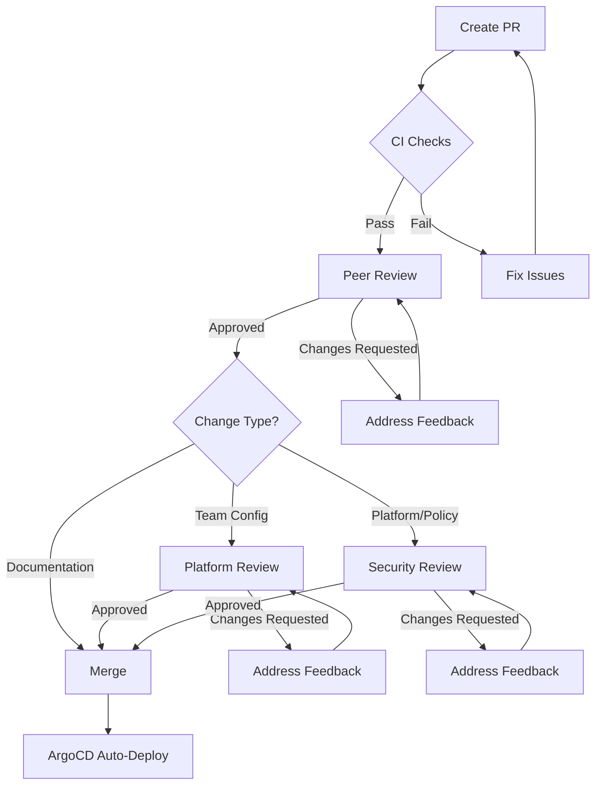

# Contributing to aws-idp-gitops

Thank you for your interest in contributing to the Internal Developer Platform GitOps repository. This document provides guidelines and best practices for contributing changes.

## Table of Contents

- [Getting Started](#getting-started)
- [Repository Structure](#repository-structure)
- [Contribution Workflow](#contribution-workflow)
- [Change Types](#change-types)
- [Pull Request Process](#pull-request-process)
- [Testing Changes](#testing-changes)
- [Style Guidelines](#style-guidelines)
- [Security Considerations](#security-considerations)

---

## Getting Started

### Prerequisites

Before contributing, ensure you have:

- [ ] GitHub account with repository access
- [ ] Git installed and configured
- [ ] kubectl installed and configured
- [ ] ArgoCD CLI installed
- [ ] Understanding of Kubernetes and GitOps principles
- [ ] Familiarity with the platform architecture

### Repository Access

Request repository access by:

1. Opening a ticket with the platform team
2. Providing your GitHub username
3. Explaining your intended contributions
4. Completing security training (if required)

---

## Repository Structure

Understanding the repository structure helps you make changes in the right location:

```
aws-idp-gitops/
├── clusters/           # Cluster-specific configurations
│   └── production/     # Production cluster config
├── platform/           # Platform components
│   ├── argocd/        # ArgoCD configuration
│   ├── kyverno/       # Policy definitions
│   ├── observability/ # Monitoring stack
│   └── ...
├── teams/             # Team configurations
│   ├── backend/       # Backend team
│   ├── frontend/      # Frontend team
│   └── ...
└── docs/              # Documentation
```

---

## Contribution Workflow

### 1. Fork and Clone

```bash
# Fork the repository on GitHub
# Then clone your fork
git clone https://github.com/<your-username>/aws-idp-gitops.git
cd aws-idp-gitops

# Add upstream remote
git remote add upstream https://github.com/fast-ish/aws-idp-gitops.git

# Keep your fork in sync
git fetch upstream
git merge upstream/main
```

### 2. Create a Branch

Use descriptive branch names following this convention:

| Change Type | Branch Prefix | Example |
|-------------|--------------|---------|
| New team | `onboard-team-` | `onboard-team-ml-platform` |
| Platform update | `platform-` | `platform-upgrade-argocd` |
| Policy change | `policy-` | `policy-add-resource-limits` |
| Bug fix | `fix-` | `fix-networkpolicy-egress` |
| Documentation | `docs-` | `docs-update-onboarding` |

```bash
# Create and checkout branch
git checkout -b <branch-prefix>-<description>
```

### 3. Make Changes

Follow these principles:

- **One change per PR**: Keep PRs focused on a single logical change
- **Test locally**: Validate YAML syntax and manifests
- **Document changes**: Update relevant documentation
- **No secrets**: Never commit sensitive data

### 4. Commit Changes

Write clear, descriptive commit messages:

```bash
# Good commit message format:
# <type>: <subject>
#
# <body>
#
# <footer>

git commit -m "feat: add data-platform team configuration

- Resource quotas: 40 CPU, 80Gi memory
- Applications: data-api, etl-pipeline, analytics-dashboard
- Network policies: allow from frontend and backend
- Ingress configured for public API endpoints

Closes #123"
```

#### Commit Message Types

| Type | Description | Example |
|------|-------------|---------|
| `feat` | New feature | `feat: add new team configuration` |
| `fix` | Bug fix | `fix: correct resource quota limits` |
| `docs` | Documentation | `docs: update onboarding guide` |
| `style` | Formatting | `style: fix YAML indentation` |
| `refactor` | Code restructuring | `refactor: reorganize kyverno policies` |
| `test` | Add tests | `test: add kyverno policy tests` |
| `chore` | Maintenance | `chore: update ArgoCD version` |

### 5. Push Changes

```bash
# Push to your fork
git push origin <branch-name>
```

### 6. Create Pull Request

1. Go to the repository on GitHub
2. Click "New Pull Request"
3. Select your branch
4. Fill out the PR template completely
5. Request reviews from appropriate team members

---

## Change Types

### Adding a New Team

**Files to modify**:
- `teams/<team-name>/team.yaml` (new file)

**Review requirements**:
- [ ] Platform team approval
- [ ] Security review
- [ ] Resource quotas justified
- [ ] Network policies reviewed

**Example PR**: See [#123](https://github.com/fast-ish/aws-idp-gitops/pull/123)

### Updating Team Configuration

**Files to modify**:
- `teams/<team-name>/team.yaml`

**Review requirements**:
- [ ] Team lead approval
- [ ] Platform team approval (for quota increases)
- [ ] Security review (for network policy changes)

**Common changes**:
- Adding new applications
- Updating resource quotas
- Modifying network policies
- Changing sync policies

### Adding Platform Components

**Files to modify**:
- `platform/<component>/` (new directory)
- `platform/<component>/kustomization.yaml`
- `platform/<component>/values.yaml`
- `clusters/production/kustomization.yaml`

**Review requirements**:
- [ ] Architecture review
- [ ] Security review
- [ ] Platform team approval
- [ ] Testing in non-production environment

### Updating Policies

**Files to modify**:
- `platform/kyverno/policies/<category>/<policy>.yaml`

**Review requirements**:
- [ ] Security team approval
- [ ] Impact analysis (how many resources affected)
- [ ] Gradual rollout plan (audit → enforce)
- [ ] Communication to affected teams

**Policy update workflow**:
1. Add new policy in **audit** mode
2. Monitor violations for 1 week
3. Communicate findings to teams
4. Switch to **enforce** mode
5. Monitor for issues

### Updating Documentation

**Files to modify**:
- `README.md`
- `docs/*.md`
- `CONTRIBUTING.md`

**Review requirements**:
- [ ] Technical accuracy verified
- [ ] Examples tested
- [ ] Links validated

---

## Pull Request Process

### PR Title Format

Use the same format as commit messages:

```
<type>: <short description>
```

Examples:
- `feat: add ml-platform team configuration`
- `fix: correct backend team resource quota`
- `docs: update policy enforcement guide`

### PR Description Template

```markdown
## Description
<!-- Brief description of the change -->

## Motivation
<!-- Why is this change needed? -->

## Changes Made
<!-- List of specific changes -->
- [ ] Change 1
- [ ] Change 2

## Testing
<!-- How was this tested? -->

## Impact
<!-- What teams/resources are affected? -->

## Checklist
- [ ] YAML syntax validated
- [ ] Documentation updated
- [ ] No secrets committed
- [ ] Follows naming conventions
- [ ] Tests passing (if applicable)

## Related Issues
<!-- Link to related issues/tickets -->
Closes #123
```

### Review Process

1. **Automated Checks**: PR must pass all CI checks
   - YAML lint
   - Kyverno policy validation
   - ArgoCD dry-run
   - Security scan

2. **Peer Review**: At least 1 approval required
   - Code review by team member
   - Technical accuracy verified
   - Best practices followed

3. **Platform Team Review**: Required for:
   - New teams
   - Platform component changes
   - Policy updates
   - Resource quota increases

4. **Security Review**: Required for:
   - Network policy changes
   - New platform components
   - RBAC modifications
   - Policy enforcement changes

### Approval Workflow



---

## Testing Changes

### Local Validation

**1. YAML Syntax**:
```bash
# Install yamllint
pip install yamllint

# Validate all YAML files
yamllint -c .yamllint .
```

**2. Kyverno Policies**:
```bash
# Install Kyverno CLI
brew install kyverno

# Test policy against resources
kyverno apply platform/kyverno/policies/baseline/ \
  --resource platform/team-resources/templates/
```

**3. ArgoCD Dry Run**:
```bash
# Login to ArgoCD
argocd login argocd.company.com --sso

# Validate application manifests
argocd app diff <app-name> --local-path <path-to-manifests>
```

### Pre-commit Hooks

Set up pre-commit hooks to catch issues early:

```bash
# Install pre-commit
pip install pre-commit

# Install hooks
pre-commit install

# Run hooks manually
pre-commit run --all-files
```

`.pre-commit-config.yaml`:
```yaml
repos:
  - repo: https://github.com/pre-commit/pre-commit-hooks
    rev: v4.4.0
    hooks:
      - id: trailing-whitespace
      - id: end-of-file-fixer
      - id: check-yaml
      - id: check-added-large-files

  - repo: https://github.com/adrienverge/yamllint
    rev: v1.32.0
    hooks:
      - id: yamllint

  - repo: local
    hooks:
      - id: no-secrets
        name: Check for secrets
        entry: ./.hooks/check-secrets.sh
        language: script
```

---

## Style Guidelines

### YAML Formatting

**Indentation**: 2 spaces (no tabs)
```yaml
# Good
apiVersion: v1
kind: Pod
metadata:
  name: example
  labels:
    app: example

# Bad (4 spaces)
apiVersion: v1
kind: Pod
metadata:
    name: example
```

**Line Length**: Maximum 120 characters
```yaml
# Good
description: >-
  This is a long description that is split
  across multiple lines for readability.

# Bad
description: "This is a very long description that extends beyond the 120 character limit and is hard to read in a standard editor"
```

**String Quoting**: Use quotes for strings with special characters
```yaml
# Good
name: "my-app"
tag: "v1.0.0"
command: "echo 'hello world'"

# Acceptable (simple strings)
name: my-app
tag: v1.0.0
```

### Naming Conventions

**Resource Names**:
- Lowercase alphanumeric and hyphens only
- No underscores or special characters
- Descriptive and specific

```yaml
# Good
name: backend-api
name: etl-data-pipeline
name: ml-model-training

# Bad
name: BackendAPI
name: etl_pipeline
name: app1
```

**Labels**:
- Use standard labels for consistency
- Required labels: `app`, `version`, `team`

```yaml
metadata:
  labels:
    app: backend-api
    version: v1.2.3
    team: backend
    component: api
    environment: production
```

### Directory Structure

**Organizing files**:
```
teams/backend/
├── team.yaml              # Team configuration
└── README.md              # Team-specific documentation

platform/component/
├── kustomization.yaml     # Kustomize configuration
├── namespace.yaml         # Namespace definition
├── values.yaml            # Helm values
└── prometheus-rules.yaml  # Monitoring rules
```

---

## Security Considerations

### Never Commit Secrets

**Prohibited**:
```yaml
# ❌ NEVER commit secrets
apiVersion: v1
kind: Secret
data:
  password: cGFzc3dvcmQ=
```

**Correct**:
```yaml
# ✅ Use ExternalSecret
apiVersion: external-secrets.io/v1beta1
kind: ExternalSecret
metadata:
  name: db-credentials
spec:
  secretStoreRef:
    name: aws-secrets-manager
  data:
    - secretKey: password
      remoteRef:
        key: /team-backend/db/password
```

### Validate Security Policies

Ensure changes comply with security policies:

```bash
# Check for policy violations
kubectl apply --dry-run=server -f manifest.yaml

# Test with Kyverno
kyverno apply platform/kyverno/policies/ --resource manifest.yaml
```

### Review Network Policies

When adding network policies:

1. Start with deny-all
2. Add specific allow rules
3. Test connectivity
4. Document the intent

### Audit Trail

All changes must have:

- Clear commit messages
- PR description explaining the change
- Approval from appropriate reviewers
- Link to related issue/ticket

---

## Getting Help

### Resources

- **Documentation**: [docs/](docs/)
- **Architecture**: [docs/ARCHITECTURE.md](docs/ARCHITECTURE.md)
- **Security**: [docs/SECURITY.md](docs/SECURITY.md)
- **Team Onboarding**: [docs/TEAM-ONBOARDING.md](docs/TEAM-ONBOARDING.md)

### Support Channels

- **Slack**: #platform-support
- **Email**: platform-team@company.com
- **Office Hours**: Tuesdays 2-3 PM
- **GitHub Issues**: For bugs and feature requests

---

## Code of Conduct

### Our Pledge

We pledge to make participation in our project a harassment-free experience for everyone, regardless of age, body size, disability, ethnicity, gender identity and expression, level of experience, nationality, personal appearance, race, religion, or sexual identity and orientation.

### Expected Behavior

- Be respectful and inclusive
- Provide constructive feedback
- Focus on what is best for the platform
- Show empathy towards other contributors

### Unacceptable Behavior

- Harassment or discrimination
- Trolling or insulting comments
- Public or private harassment
- Publishing others' private information

### Enforcement

Violations of the code of conduct should be reported to platform-team@company.com. All complaints will be reviewed and investigated.

---

## License

By contributing to this repository, you agree that your contributions will be licensed under the MIT License.

---

## Questions?

If you have questions about contributing, please:

1. Check the documentation
2. Search existing issues
3. Ask in #platform-support Slack channel
4. Email platform-team@company.com

Thank you for contributing to making the Internal Developer Platform better!
