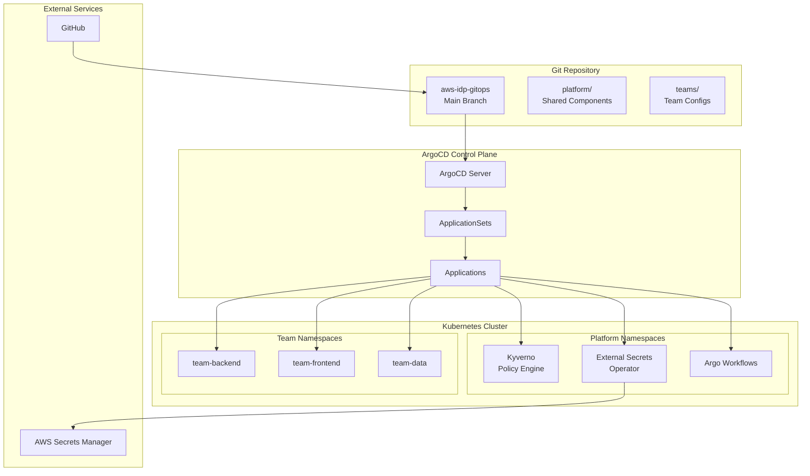
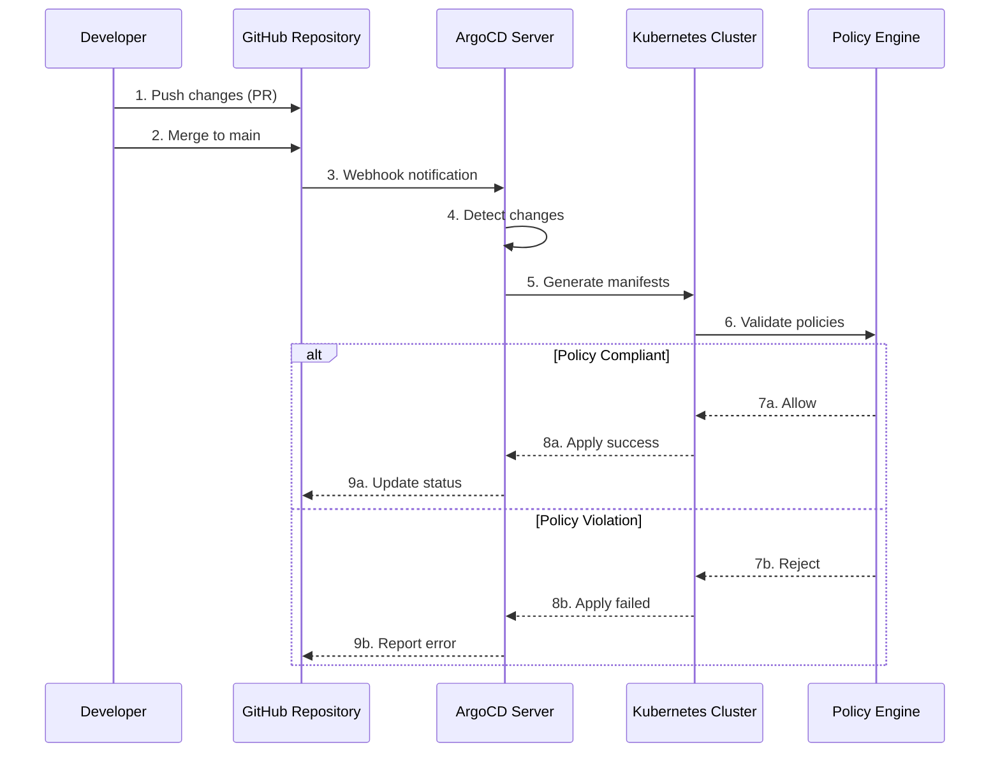
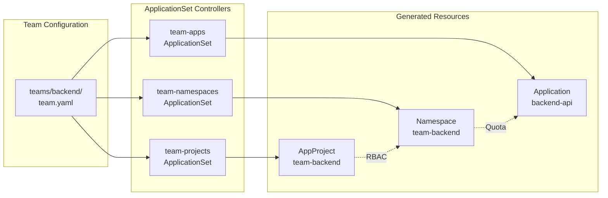
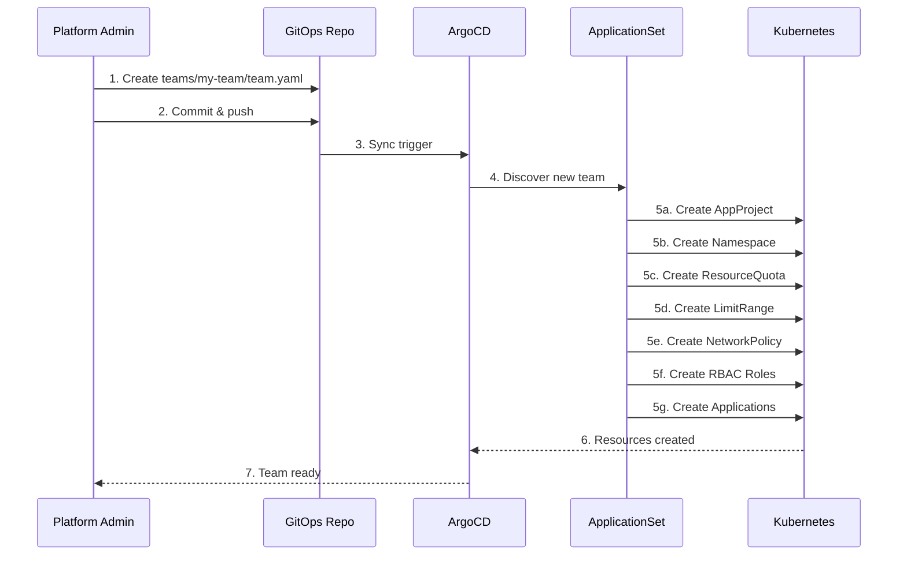

# aws-idp-gitops

<div align="center">

*GitOps repository for the Internal Developer Platform (IDP). Managed by ArgoCD, this repository contains all Kubernetes manifests for platform components and team applications, providing automated deployment, policy enforcement, and multi-tenancy for development teams.*

[](https://opensource.org/licenses/MIT)
[](https://argo-cd.readthedocs.io/)
[](https://kubernetes.io/)
[](https://kyverno.io/)
[](https://argoproj.github.io/workflows/)
[](https://external-secrets.io/)
[](https://helm.sh/)

</div>

---

## Overview

This GitOps repository serves as the single source of truth for all Kubernetes workloads running on the Internal Developer Platform. It implements a multi-tenant architecture where platform teams and development teams can deploy and manage their applications through declarative Git-based workflows. ArgoCD continuously monitors this repository and automatically syncs changes to the cluster, ensuring the desired state defined in Git is reflected in the running infrastructure.

### Key Features

| Feature | Description | Reference |
|---------|-------------|-----------|
| **GitOps Workflow** | Declarative Kubernetes configuration with automatic synchronization | [ArgoCD](https://argo-cd.readthedocs.io/) |
| **Multi-Tenancy** | Isolated namespaces with resource quotas and network policies | [Team Resources](#teams) |
| **Policy Enforcement** | Automated security and compliance policies via Kyverno | [Policy Enforcement](#policy-enforcement) |
| **ApplicationSets** | Dynamic application generation from team configurations | [ApplicationSets](https://argo-cd.readthedocs.io/en/stable/user-guide/application-set/) |
| **Secrets Management** | Automated secret synchronization from AWS Secrets Manager | [External Secrets](https://external-secrets.io/) |
| **CI/CD Pipelines** | Argo Workflows for build, test, and deployment automation | [Argo Workflows](https://argoproj.github.io/workflows/) |

---

## Architecture

### System Overview



### GitOps Workflow



### ApplicationSet Generation Flow



### Team Provisioning Flow



---

## Repository Structure

```
aws-idp-gitops/
├── README.md
├── clusters/                    # Cluster-specific configurations
│   └── production/
│       ├── kustomization.yaml   # What's deployed to this cluster
│       └── cluster-config.yaml  # Cluster metadata
├── platform/                    # Platform components (shared)
│   ├── external-secrets/        # External Secrets Operator config
│   ├── kyverno/                 # Policy engine
│   │   └── policies/
│   │       ├── baseline/        # Pod Security Standards (Enforce)
│   │       ├── best-practices/  # Best practices (Audit)
│   │       └── mutations/       # Default mutations
│   ├── argo-workflows/          # CI pipeline templates
│   ├── argo-events/             # Event-driven automation
│   ├── argo-rollouts/           # Progressive delivery
│   ├── argocd/                  # GitOps configuration
│   │   ├── applicationsets/     # ApplicationSets for teams
│   │   └── kustomization.yaml
│   ├── backstage/               # Developer portal
│   ├── observability/           # Monitoring stack
│   │   ├── grafana/
│   │   ├── prometheus/
│   │   ├── loki/
│   │   └── tempo/
│   ├── cost-management/         # Cost tracking (OpenCost)
│   ├── trivy-operator/          # Security scanning
│   ├── falco/                   # Runtime security
│   ├── velero/                  # Backup & disaster recovery
│   ├── goldilocks/              # Resource optimization
│   ├── vpa/                     # Vertical Pod Autoscaler
│   ├── spot-handler/            # Spot instance management
│   ├── team-resources/          # Helm chart for team namespaces
│   │   └── templates/
│   │       ├── namespace.yaml
│   │       ├── resource-quota.yaml
│   │       ├── limit-range.yaml
│   │       ├── network-policy.yaml
│   │       └── rbac.yaml
│   └── team-project/            # Helm chart for ArgoCD AppProjects
└── teams/                       # Team configurations
    ├── platform/
    ├── backend/
    ├── frontend/
    ├── data/
    ├── ml/
    └── integrations/
```

---

## How It Works

1. **ArgoCD watches this repository** - Any changes merged to `main` are automatically synced to the cluster
2. **ApplicationSets generate resources** - Three ApplicationSets process `teams/*/team.yaml`:
   - `team-projects` - Creates ArgoCD AppProjects with RBAC
   - `team-namespaces` - Creates namespaces with quotas, limits, and network policies
   - `team-apps` - Deploys each team's applications
3. **Kyverno enforces policies** - Security policies are applied to all workloads
4. **External Secrets syncs credentials** - AWS Secrets Manager secrets are automatically synced

---

## Teams

Teams are organized by function. Each team gets:
- **Dedicated namespace** with resource quotas and limits
- **Network policies** controlling ingress/egress
- **RBAC roles** (developer, viewer)
- **ArgoCD AppProject** scoped to their namespace

| Team | Namespace | Description |
|------|-----------|-------------|
| `platform` | `team-platform` | Platform engineering - internal tools and developer experience |
| `backend` | `team-backend` | Backend services - APIs, microservices, and core business logic |
| `frontend` | `team-frontend` | Frontend team - web applications, SSR, and static sites |
| `data` | `team-data` | Data engineering - ETL pipelines, data APIs, and analytics |
| `ml` | `team-ml` | Machine learning - model training, inference, and feature engineering |
| `integrations` | `team-integrations` | Integrations - third-party APIs, webhooks, and external connectors |

---

## Adding a New Team

### Step 1: Create Team Directory

```bash
mkdir -p teams/my-team
```

### Step 2: Create Team Configuration

Create `teams/my-team/team.yaml`:

```yaml
name: my-team
namespace: team-my-team
description: "My team description"

owner:
  name: "My Team"
  email: my-team@example.com
  slack: "#my-team"

resourceQuota:
  requests:
    cpu: "10"
    memory: "20Gi"
  limits:
    cpu: "20"
    memory: "40Gi"
  pods: "30"
  services: "10"
  configmaps: "20"
  secrets: "20"
  persistentvolumeclaims: "5"

limitRange:
  default:
    cpu: "500m"
    memory: "512Mi"
  defaultRequest:
    cpu: "100m"
    memory: "128Mi"
  max:
    cpu: "2"
    memory: "4Gi"

networkPolicy:
  allowIngress: true
  allowEgress: true
  allowFromNamespaces:
    - argocd
    - monitoring

apps:
  - name: my-service
    repoURL: https://github.com/fast-ish/my-service
    path: k8s
    targetRevision: main
    environment: production
```

### Step 3: Submit Changes

```bash
git add teams/my-team/
git commit -m "Add my-team configuration"
git push origin feature/add-my-team
```

### Step 4: Verify Deployment

After merging the PR, ArgoCD will automatically:
1. Create the ArgoCD AppProject
2. Provision the namespace with all policies
3. Deploy the team's applications

Verify with:

```bash
# Check AppProject
kubectl get appproject -n argocd team-my-team

# Check namespace
kubectl get namespace team-my-team

# Check applications
kubectl get applications -n argocd -l team=my-team
```

---

## What Gets Created Per Team

When a team is added, the ApplicationSets automatically create:

### ArgoCD AppProject (`team-{name}`)

```yaml
apiVersion: argoproj.io/v1alpha1
kind: AppProject
metadata:
  name: team-{name}
spec:
  # Scoped to team's namespace only
  destinations:
    - namespace: team-{name}
      server: https://kubernetes.default.svc

  # Source repos
  sourceRepos:
    - 'https://github.com/fast-ish/*'
    - 'https://github.com/{team}/*'

  # Allowed resources
  clusterResourceWhitelist:
    - group: ''
      kind: Namespace
  namespaceResourceWhitelist:
    - group: '*'
      kind: '*'

  # Blocked resources (platform-managed)
  namespaceResourceBlacklist:
    - group: ''
      kind: ResourceQuota
    - group: ''
      kind: LimitRange
    - group: 'networking.k8s.io'
      kind: NetworkPolicy

  # RBAC roles
  roles:
    - name: developer
      policies:
        - p, proj:team-{name}:developer, applications, sync, team-{name}/*, allow
    - name: viewer
      policies:
        - p, proj:team-{name}:viewer, applications, get, team-{name}/*, allow
```

### Namespace Resources

- **Namespace** with Pod Security Standards labels (restricted)
- **ResourceQuota** limiting CPU, memory, pods, services, etc.
- **LimitRange** setting default/max container resources
- **NetworkPolicy** controlling traffic flow
- **ServiceAccount** for workloads
- **RBAC Roles** (developer, viewer)

### Applications

- One ArgoCD Application per entry in `apps[]`
- Auto-synced from the specified Git repository
- Deployed to the team's namespace

---

## Platform Components

| Component | Purpose | Namespace | Reference |
|-----------|---------|-----------|-----------|
| **External Secrets** | Sync AWS Secrets Manager → K8s Secrets | `external-secrets` | [external-secrets.io](https://external-secrets.io/) |
| **Kyverno** | Policy engine for security & governance | `kyverno` | [kyverno.io](https://kyverno.io/) |
| **Argo Workflows** | CI pipelines (build, test, deploy) | `argo` | [argoproj.github.io/workflows](https://argoproj.github.io/workflows/) |
| **Argo Events** | Event-driven automation | `argo-events` | [argoproj.github.io/events](https://argoproj.github.io/events/) |
| **Argo Rollouts** | Progressive delivery (canary, blue/green) | `argo-rollouts` | [argoproj.github.io/rollouts](https://argoproj.github.io/rollouts/) |
| **ArgoCD** | GitOps continuous deployment | `argocd` | [argo-cd.readthedocs.io](https://argo-cd.readthedocs.io/) |
| **Backstage** | Developer portal & service catalog | `backstage` | [backstage.io](https://backstage.io/) |
| **Prometheus** | Metrics collection and alerting | `monitoring` | [prometheus.io](https://prometheus.io/) |
| **Grafana** | Visualization and dashboards | `monitoring` | [grafana.com](https://grafana.com/) |
| **Loki** | Log aggregation | `monitoring` | [grafana.com/loki](https://grafana.com/oss/loki/) |
| **Tempo** | Distributed tracing | `monitoring` | [grafana.com/tempo](https://grafana.com/oss/tempo/) |
| **OpenCost** | Kubernetes cost monitoring | `cost-management` | [opencost.io](https://www.opencost.io/) |
| **Trivy Operator** | Vulnerability scanning | `trivy-system` | [aquasecurity.github.io/trivy](https://aquasecurity.github.io/trivy-operator/) |
| **Falco** | Runtime security monitoring | `falco` | [falco.org](https://falco.org/) |
| **Velero** | Backup & disaster recovery | `velero` | [velero.io](https://velero.io/) |
| **Goldilocks** | VPA recommendations dashboard | `goldilocks` | [goldilocks](https://github.com/FairwindsOps/goldilocks) |
| **VPA** | Vertical Pod Autoscaler | `kube-system` | [VPA](https://github.com/kubernetes/autoscaler/tree/master/vertical-pod-autoscaler) |
| **Spot Handler** | Spot instance interruption handling | `kube-system` | [AWS NTH](https://github.com/aws/aws-node-termination-handler) |

---

## Policy Enforcement

### Baseline (Enforced)

These policies are enforced and will block non-compliant workloads:

| Policy | Description | Action |
|--------|-------------|--------|
| **No Privileged Containers** | Prevents privileged mode | Block |
| **No Host Namespaces** | Blocks host PID, IPC, Network | Block |
| **No Host Ports** | Prevents binding to host ports | Block |
| **Limited Capabilities** | Only NET_BIND_SERVICE allowed | Block |
| **Read-Only Root Filesystem** | Containers must use read-only root | Block |
| **Non-Root User** | Containers must run as non-root | Block |

### Best Practices (Audit)

These policies are audited and generate warnings:

| Policy | Description | Action |
|--------|-------------|--------|
| **Resource Requests/Limits** | CPU and memory must be specified | Audit |
| **Standard Labels** | Required labels (app, version, team) | Audit |
| **Liveness Probes** | Health checks required | Audit |
| **Readiness Probes** | Startup checks required | Audit |
| **Image Pull Policy** | Must be IfNotPresent or Always | Audit |

### Network Policies (Per Team)

Automatically applied to each team namespace:

```yaml
# Default deny all ingress/egress
apiVersion: networking.k8s.io/v1
kind: NetworkPolicy
metadata:
  name: default-deny-all
spec:
  podSelector: {}
  policyTypes:
    - Ingress
    - Egress

# Allow traffic within namespace
- Allow DNS resolution (kube-dns)
- Allow ingress from ALB
- Allow egress to AWS services
- Allow traffic from monitoring namespace
```

---

## Team Resource Quotas

Default quotas can be customized per team:

| Team Type | CPU Requests | Memory Requests | Pods | Services | PVCs |
|-----------|--------------|-----------------|------|----------|------|
| Platform | 10 cores | 20Gi | 30 | 10 | 5 |
| Backend | 20 cores | 40Gi | 50 | 15 | 10 |
| Frontend | 8 cores | 16Gi | 30 | 10 | 5 |
| Data | 40 cores | 80Gi | 40 | 20 | 20 |
| ML | 32 cores | 128Gi | 25 | 10 | 15 |
| Integrations | 12 cores | 24Gi | 40 | 15 | 5 |

---

## Prerequisites

| Requirement | Version | Purpose |
|-------------|---------|---------|
| **Kubernetes Cluster** | 1.28+ | EKS cluster running on AWS |
| **kubectl** | 1.28+ | Kubernetes command-line tool |
| **ArgoCD** | 2.8+ | GitOps deployment operator |
| **Helm** | 3.x | Package manager for Kubernetes |
| **GitHub CLI** | Latest | Repository management |

**Cluster Requirements**:

- EKS cluster provisioned via [aws-idp-infra](https://github.com/fast-ish/aws-idp-infra)
- ArgoCD installed and configured
- AWS IAM roles for service accounts (IRSA) configured
- VPC CNI plugin with network policy support enabled

**Verification**:

```bash
# Verify kubectl access
kubectl version --short

# Verify ArgoCD is running
kubectl get pods -n argocd

# Verify Kyverno is running
kubectl get pods -n kyverno

# Verify External Secrets
kubectl get pods -n external-secrets
```

---

## Configuration Reference

### Team Configuration Schema

The `team.yaml` file supports the following fields:

| Field | Type | Required | Description |
|-------|------|----------|-------------|
| `name` | string | Yes | Team identifier (lowercase, alphanumeric, hyphens) |
| `namespace` | string | Yes | Kubernetes namespace (must start with `team-`) |
| `description` | string | Yes | Human-readable team description |
| `owner.name` | string | Yes | Team name for contact |
| `owner.email` | string | Yes | Team email address |
| `owner.slack` | string | No | Slack channel for team |
| `resourceQuota` | object | Yes | Resource limits for namespace |
| `limitRange` | object | Yes | Default container resource limits |
| `networkPolicy` | object | Yes | Network access configuration |
| `apps` | array | Yes | List of applications to deploy |

### Resource Quota Schema

```yaml
resourceQuota:
  requests:
    cpu: "10"           # Total CPU requests
    memory: "20Gi"      # Total memory requests
  limits:
    cpu: "20"           # Total CPU limits
    memory: "40Gi"      # Total memory limits
  pods: "30"            # Maximum pods
  services: "10"        # Maximum services
  configmaps: "20"      # Maximum ConfigMaps
  secrets: "20"         # Maximum Secrets
  persistentvolumeclaims: "5"  # Maximum PVCs
```

### Application Schema

```yaml
apps:
  - name: my-app                              # Application name
    repoURL: https://github.com/org/repo      # Git repository URL
    path: k8s                                 # Path to manifests
    targetRevision: main                      # Branch/tag/commit
    environment: production                   # Environment label
    syncPolicy:                               # Optional: custom sync policy
      automated:
        prune: true
        selfHeal: true
```

---

## Troubleshooting

### Quick Diagnostics

```bash
# Check ArgoCD application status
kubectl get applications -n argocd

# Check application sync status
kubectl get app -n argocd team-backend-api -o jsonpath='{.status.sync.status}'

# View application details
argocd app get team-backend-api

# Check ApplicationSet status
kubectl get applicationsets -n argocd

# View ApplicationSet logs
kubectl logs -n argocd -l app.kubernetes.io/name=argocd-applicationset-controller

# Check Kyverno policy reports
kubectl get policyreport -A

# View policy violations
kubectl describe policyreport -n team-backend

# Check External Secrets status
kubectl get externalsecrets -A
kubectl get secretstores -A

# View External Secrets Operator logs
kubectl logs -n external-secrets -l app.kubernetes.io/name=external-secrets
```

### Common Issues

| Issue | Symptom | Resolution |
|-------|---------|------------|
| **Application OutOfSync** | ArgoCD shows red status | Check `git log` for recent changes, verify manifests are valid |
| **Policy Violation** | Pods not starting | Check `kubectl get policyreport` for violations, update manifests |
| **Secret Not Found** | Application fails to mount secret | Verify ExternalSecret exists and SecretStore is configured |
| **Resource Quota Exceeded** | Pod pending with quota error | Increase team quota or reduce resource requests |
| **Network Policy Blocking** | Service connectivity issues | Review NetworkPolicy rules, add required namespace labels |
| **ApplicationSet Not Generating** | Team resources not created | Check ApplicationSet logs, verify team.yaml syntax |

### Application Sync Troubleshooting

```bash
# Force sync an application
argocd app sync team-backend-api

# Refresh application (re-check Git)
argocd app refresh team-backend-api

# View sync operation details
argocd app get team-backend-api --show-operation

# Delete and recreate application (last resort)
kubectl delete application -n argocd team-backend-api
# ApplicationSet will recreate it
```

### Policy Troubleshooting

```bash
# Test a policy against a manifest
kyverno apply /path/to/policy.yaml --resource /path/to/manifest.yaml

# View all policy reports
kubectl get policyreport -A -o wide

# Get detailed policy report
kubectl get policyreport -n team-backend -o yaml

# Check Kyverno webhook status
kubectl get validatingwebhookconfigurations | grep kyverno
kubectl get mutatingwebhookconfigurations | grep kyverno
```

---

## Related Documentation

### Platform Repositories

| Repository | Description |
|------------|-------------|
| [aws-idp-infra](https://github.com/fast-ish/aws-idp-infra) | CDK infrastructure for EKS cluster, RDS, and platform services |
| [aws-eks-infra](https://github.com/fast-ish/aws-eks-infra) | Standalone EKS cluster infrastructure |
| [aws-druid-infra](https://github.com/fast-ish/aws-druid-infra) | Apache Druid analytics infrastructure |
| [aws-webapp-infra](https://github.com/fast-ish/aws-webapp-infra) | Serverless web application infrastructure |
| [backstage-ext](https://github.com/fast-ish/backstage-ext) | Backstage developer portal application |
| [cdk-common](https://github.com/fast-ish/cdk-common) | Shared CDK constructs and utilities |

### ArgoCD Documentation

| Resource | Description |
|----------|-------------|
| [ArgoCD Documentation](https://argo-cd.readthedocs.io/) | Official ArgoCD documentation |
| [ApplicationSets](https://argo-cd.readthedocs.io/en/stable/user-guide/application-set/) | Dynamic application generation |
| [App of Apps Pattern](https://argo-cd.readthedocs.io/en/stable/operator-manual/cluster-bootstrapping/) | Cluster bootstrapping approach |
| [Sync Phases and Waves](https://argo-cd.readthedocs.io/en/stable/user-guide/sync-waves/) | Controlling deployment order |
| [Health Assessment](https://argo-cd.readthedocs.io/en/stable/operator-manual/health/) | Custom health checks |

### Kyverno Documentation

| Resource | Description |
|----------|-------------|
| [Kyverno Documentation](https://kyverno.io/docs/) | Official Kyverno documentation |
| [Policy Library](https://kyverno.io/policies/) | Pre-built policy examples |
| [Pod Security Standards](https://kyverno.io/policies/pod-security/) | PSS policy mappings |
| [Best Practices](https://kyverno.io/docs/writing-policies/best-practices/) | Policy writing guidelines |

### Kubernetes Documentation

| Resource | Description |
|----------|-------------|
| [Kubernetes Documentation](https://kubernetes.io/docs/home/) | Official Kubernetes docs |
| [Network Policies](https://kubernetes.io/docs/concepts/services-networking/network-policies/) | Network policy guide |
| [Resource Quotas](https://kubernetes.io/docs/concepts/policy/resource-quotas/) | Resource quota documentation |
| [RBAC Authorization](https://kubernetes.io/docs/reference/access-authn-authz/rbac/) | Role-based access control |
| [Pod Security Standards](https://kubernetes.io/docs/concepts/security/pod-security-standards/) | Security baseline standards |

### External Secrets Documentation

| Resource | Description |
|----------|-------------|
| [External Secrets Operator](https://external-secrets.io/) | Official documentation |
| [AWS Secrets Manager Provider](https://external-secrets.io/latest/provider/aws-secrets-manager/) | AWS integration guide |
| [Secret Store Configuration](https://external-secrets.io/latest/api/secretstore/) | SecretStore API reference |

---

## License

[MIT License](LICENSE)

For your convenience, you can find the full MIT license text at:
- [https://opensource.org/license/mit/](https://opensource.org/license/mit/) (Official OSI website)
- [https://choosealicense.com/licenses/mit/](https://choosealicense.com/licenses/mit/) (Choose a License website)
