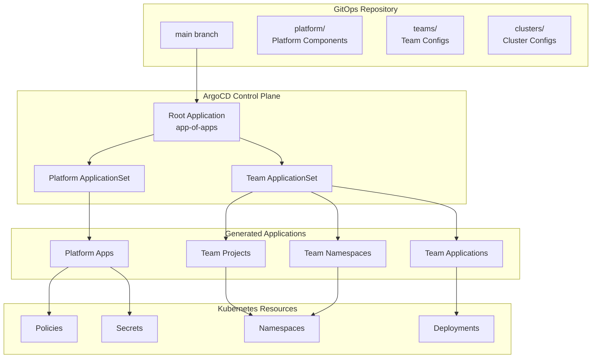
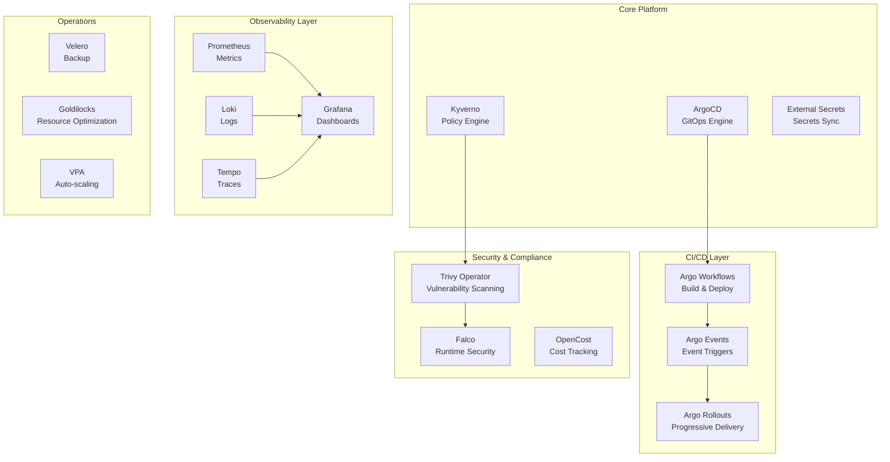
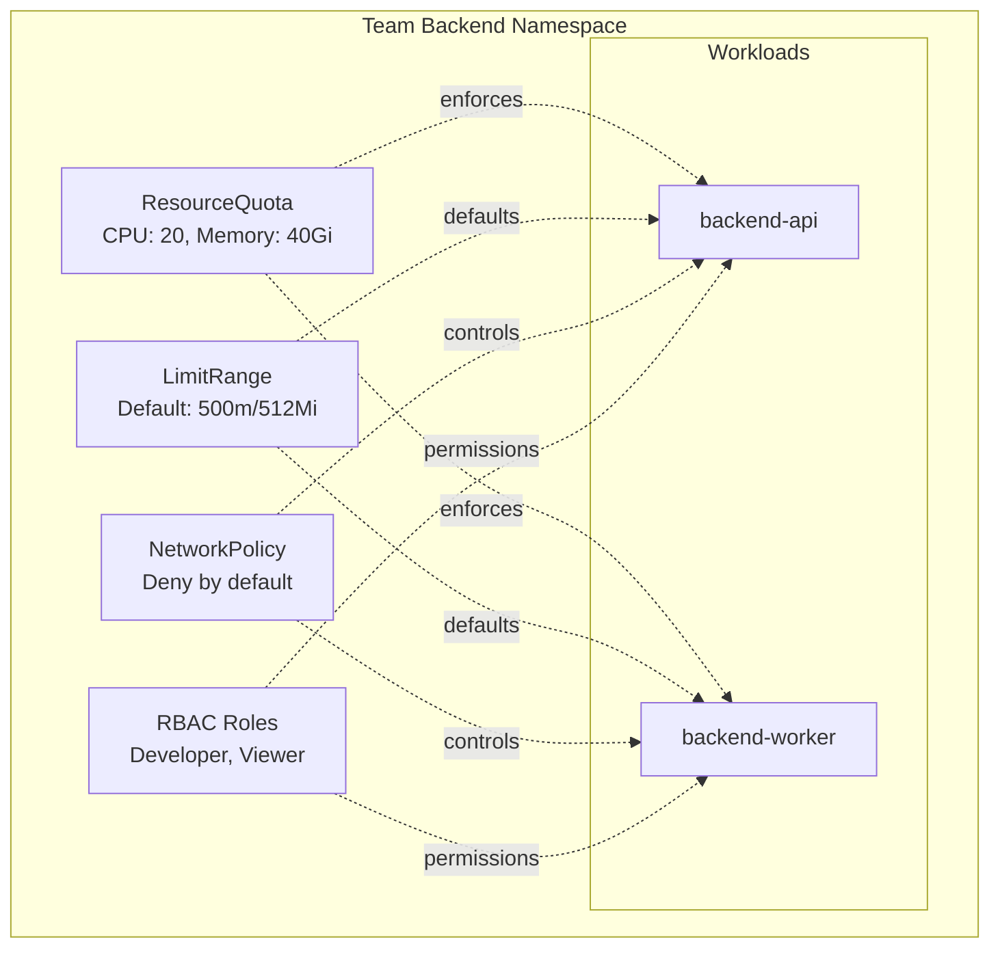
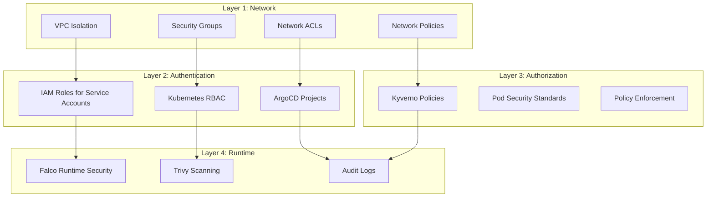
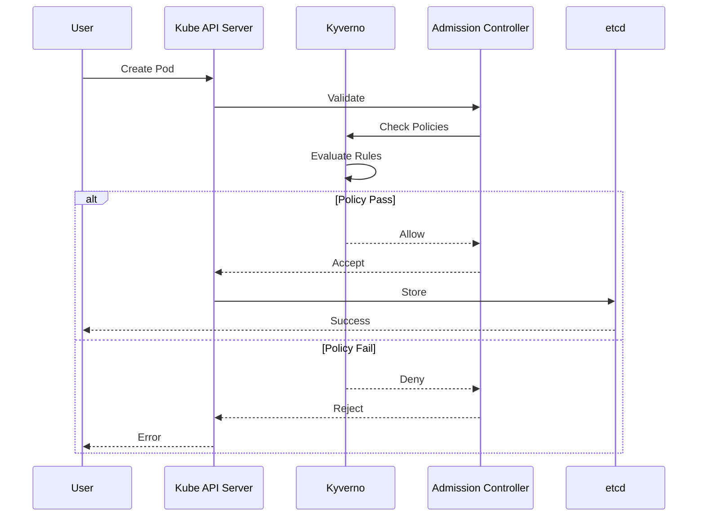
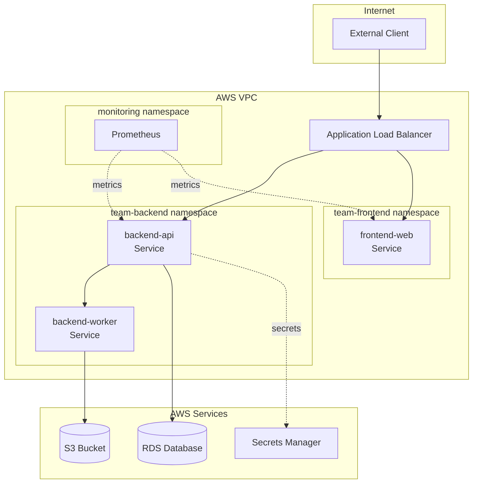
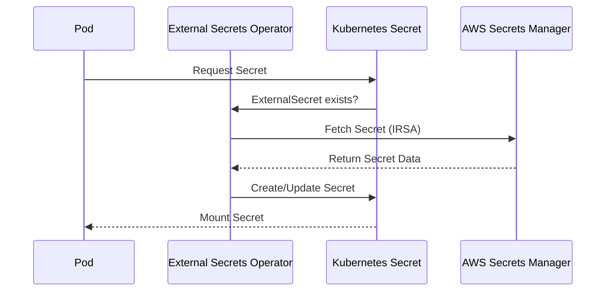

# Architecture Guide

This document provides detailed architecture information for the aws-idp-gitops repository and how it integrates with the Internal Developer Platform.

## Table of Contents

- [Overview](#overview)
- [GitOps Architecture](#gitops-architecture)
- [Component Architecture](#component-architecture)
- [Multi-Tenancy Model](#multi-tenancy-model)
- [Security Architecture](#security-architecture)
- [Network Architecture](#network-architecture)
- [Integration Points](#integration-points)

---

## Overview

The aws-idp-gitops repository implements a declarative, Git-based approach to managing Kubernetes resources. It serves as the single source of truth for all platform and application configurations deployed to the EKS cluster.

### Design Principles

| Principle | Description | Implementation |
|-----------|-------------|----------------|
| **Declarative** | Desired state defined in Git | All resources defined as YAML manifests |
| **Immutable** | No manual changes to cluster | ArgoCD enforces Git as source of truth |
| **Auditable** | All changes tracked in Git history | Pull requests and commit logs provide audit trail |
| **Self-Healing** | Automatic drift detection and correction | ArgoCD continuously reconciles actual vs desired state |
| **Separation of Concerns** | Platform vs application configs | Platform in `/platform`, teams in `/teams` |

---

## GitOps Architecture

### ArgoCD Deployment Model



### App of Apps Pattern

The repository uses the "App of Apps" pattern where a root ArgoCD Application manages other Applications and ApplicationSets:

```yaml
# Root Application
apiVersion: argoproj.io/v1alpha1
kind: Application
metadata:
  name: root-app
  namespace: argocd
spec:
  project: platform
  source:
    repoURL: https://github.com/fast-ish/aws-idp-gitops
    path: clusters/production
    targetRevision: main
  destination:
    server: https://kubernetes.default.svc
    namespace: argocd
  syncPolicy:
    automated:
      prune: true
      selfHeal: true
```

### Sync Waves

Resources are deployed in a specific order using sync waves:

| Wave | Components | Purpose |
|------|-----------|---------|
| **-5** | Namespaces | Create namespaces first |
| **-4** | CRDs | Install custom resource definitions |
| **-3** | RBAC | Set up permissions |
| **-2** | ConfigMaps, Secrets | Configuration data |
| **-1** | PVCs | Storage resources |
| **0** | Standard resources | Default deployment wave |
| **1** | Services | After deployments |
| **2** | Ingresses | After services |

---

## Component Architecture

### Platform Components Layer



### ApplicationSet Architecture

Three ApplicationSets manage team resources:

#### 1. Team Projects ApplicationSet

Creates ArgoCD AppProjects with RBAC:

```yaml
apiVersion: argoproj.io/v1alpha1
kind: ApplicationSet
metadata:
  name: team-projects
spec:
  generators:
    - git:
        repoURL: https://github.com/fast-ish/aws-idp-gitops
        revision: main
        files:
          - path: "teams/*/team.yaml"
  template:
    metadata:
      name: '{{name}}-project'
    spec:
      project: platform
      source:
        repoURL: https://github.com/fast-ish/aws-idp-gitops
        path: platform/team-project
        helm:
          values: |
            {{values}}
```

#### 2. Team Namespaces ApplicationSet

Provisions namespace infrastructure:

```yaml
apiVersion: argoproj.io/v1alpha1
kind: ApplicationSet
metadata:
  name: team-namespaces
spec:
  generators:
    - git:
        repoURL: https://github.com/fast-ish/aws-idp-gitops
        revision: main
        files:
          - path: "teams/*/team.yaml"
  template:
    metadata:
      name: '{{name}}-namespace'
    spec:
      project: platform
      source:
        repoURL: https://github.com/fast-ish/aws-idp-gitops
        path: platform/team-resources
        helm:
          values: |
            {{values}}
```

#### 3. Team Apps ApplicationSet

Deploys team applications:

```yaml
apiVersion: argoproj.io/v1alpha1
kind: ApplicationSet
metadata:
  name: team-apps
spec:
  generators:
    - matrix:
        generators:
          - git:
              repoURL: https://github.com/fast-ish/aws-idp-gitops
              revision: main
              files:
                - path: "teams/*/team.yaml"
          - list:
              elements: '{{apps}}'
  template:
    metadata:
      name: '{{name}}-{{app.name}}'
    spec:
      project: 'team-{{name}}'
      source:
        repoURL: '{{app.repoURL}}'
        path: '{{app.path}}'
        targetRevision: '{{app.targetRevision}}'
```

---

## Multi-Tenancy Model

### Namespace Isolation

Each team receives a dedicated namespace with strict isolation:



### Resource Hierarchy

```
AppProject (team-backend)
├── Scoped to namespace: team-backend
├── Source repositories: github.com/fast-ish/*
├── RBAC Roles
│   ├── developer: sync, update, delete
│   └── viewer: get, list
└── Resource Whitelist/Blacklist
    ├── Allowed: Deployments, Services, ConfigMaps
    └── Blocked: ResourceQuota, LimitRange, NetworkPolicy
```

---

## Security Architecture

### Defense in Depth

Multiple security layers protect the platform:



### Policy Enforcement Flow



---

## Network Architecture

### Namespace Network Isolation



### Default Network Policies

Each team namespace gets these policies by default:

1. **Default Deny All**
```yaml
apiVersion: networking.k8s.io/v1
kind: NetworkPolicy
metadata:
  name: default-deny-all
spec:
  podSelector: {}
  policyTypes:
    - Ingress
    - Egress
```

2. **Allow DNS**
```yaml
apiVersion: networking.k8s.io/v1
kind: NetworkPolicy
metadata:
  name: allow-dns
spec:
  podSelector: {}
  policyTypes:
    - Egress
  egress:
    - to:
        - namespaceSelector:
            matchLabels:
              name: kube-system
      ports:
        - protocol: UDP
          port: 53
```

3. **Allow Intra-Namespace**
```yaml
apiVersion: networking.k8s.io/v1
kind: NetworkPolicy
metadata:
  name: allow-same-namespace
spec:
  podSelector: {}
  policyTypes:
    - Ingress
  ingress:
    - from:
        - podSelector: {}
```

---

## Integration Points

### AWS Integration

| Service | Purpose | Authentication |
|---------|---------|----------------|
| **Secrets Manager** | Secret storage and rotation | IRSA (IAM Roles for Service Accounts) |
| **ECR** | Container image registry | IRSA with pull permissions |
| **S3** | Backup storage (Velero), logs | IRSA with read/write permissions |
| **CloudWatch** | Logs and metrics | IRSA with write permissions |
| **EKS** | Kubernetes control plane | IAM authentication |

### External Secrets Flow



### Platform Service Integration

When deployed via the Fastish platform:

| Component | Integration Point | Purpose |
|-----------|------------------|---------|
| **Orchestrator** | CodePipeline | Automated deployment triggers |
| **Portal** | API Gateway | User management and provisioning |
| **Network** | VPC Peering | Cross-stack connectivity |
| **Reporting** | CloudWatch | Usage metrics and billing |

---

## Best Practices

### Repository Organization

1. **Keep platform and teams separate**: Platform components in `/platform`, team configs in `/teams`
2. **Use clear naming**: `team-{name}` for namespaces, `{team}-{app}` for applications
3. **Document changes**: Meaningful commit messages and PR descriptions
4. **Version control**: Use Git tags for releases

### ArgoCD Configuration

1. **Use ApplicationSets**: Dynamic generation from team configs
2. **Enable auto-sync**: For non-production environments
3. **Set sync waves**: Control deployment order
4. **Health checks**: Define custom health assessments

### Security Best Practices

1. **Principle of least privilege**: Minimal RBAC permissions
2. **Network segmentation**: NetworkPolicies for all namespaces
3. **Secret management**: Never commit secrets to Git
4. **Regular scanning**: Enable Trivy for vulnerability detection

---

## Related Documentation

- [README](../README.md) - Main documentation
- [Policy Guide](POLICY-GUIDE.md) - Policy enforcement details
- [Team Onboarding](TEAM-ONBOARDING.md) - Team onboarding process
- [Security](SECURITY.md) - Security best practices
