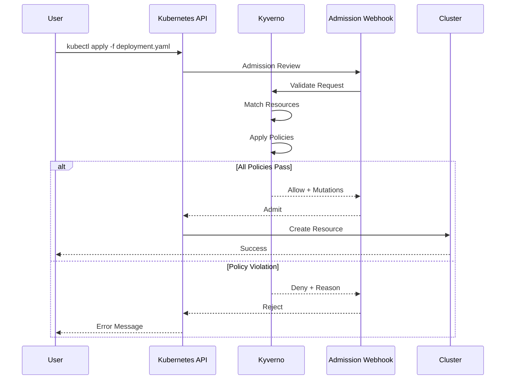

# Policy Enforcement Guide

This guide provides detailed information about the policy enforcement mechanisms in the Internal Developer Platform using Kyverno.

## Table of Contents

- [Overview](#overview)
- [Policy Categories](#policy-categories)
- [Baseline Policies](#baseline-policies)
- [Best Practice Policies](#best-practice-policies)
- [Mutation Policies](#mutation-policies)
- [Policy Development](#policy-development)
- [Testing Policies](#testing-policies)
- [Troubleshooting](#troubleshooting)

---

## Overview

Kyverno is a policy engine designed for Kubernetes that validates, mutates, and generates configurations. It runs as a dynamic admission controller and intercepts requests to the Kubernetes API server.

### How Policies Work



### Validation Modes

| Mode | Description | Use Case |
|------|-------------|----------|
| **Enforce** | Blocks non-compliant resources | Security policies, compliance requirements |
| **Audit** | Logs violations but allows resources | Best practices, gradual enforcement |
| **Warn** | Shows warnings without blocking | Development feedback |

---

## Policy Categories

### Policy Directory Structure

```
platform/kyverno/policies/
├── baseline/              # Pod Security Standards (Enforce)
│   ├── disallow-privileged.yaml
│   ├── disallow-host-namespaces.yaml
│   ├── disallow-host-ports.yaml
│   ├── restrict-capabilities.yaml
│   ├── require-ro-rootfs.yaml
│   └── require-non-root.yaml
├── best-practices/        # Best practices (Audit)
│   ├── require-resources.yaml
│   ├── require-labels.yaml
│   ├── require-probes.yaml
│   └── require-pod-disruption-budget.yaml
└── mutations/             # Default mutations
    ├── add-default-resources.yaml
    ├── add-imagepullpolicy.yaml
    └── add-network-policy-label.yaml
```

---

## Baseline Policies

These policies implement [Pod Security Standards](https://kubernetes.io/docs/concepts/security/pod-security-standards/) at the **Restricted** level and are **enforced**.

### 1. Disallow Privileged Containers

**Policy**: `disallow-privileged`
**Validation**: `enforce`

Prevents containers from running in privileged mode, which grants access to all devices on the host.

```yaml
apiVersion: kyverno.io/v1
kind: ClusterPolicy
metadata:
  name: disallow-privileged
  annotations:
    policies.kyverno.io/title: Disallow Privileged Containers
    policies.kyverno.io/category: Pod Security Standards (Baseline)
    policies.kyverno.io/severity: high
    policies.kyverno.io/description: >-
      Privileged containers have access to all devices on the host.
      This policy ensures containers do not run in privileged mode.
spec:
  validationFailureAction: Enforce
  background: true
  rules:
    - name: privileged-containers
      match:
        any:
          - resources:
              kinds:
                - Pod
      validate:
        message: "Privileged containers are not allowed"
        pattern:
          spec:
            containers:
              - =(securityContext):
                  =(privileged): false
```

**Why it matters**: Privileged containers can break out of container isolation and compromise the host.

### 2. Disallow Host Namespaces

**Policy**: `disallow-host-namespaces`
**Validation**: `enforce`

Prevents pods from sharing host namespaces (PID, IPC, Network).

```yaml
apiVersion: kyverno.io/v1
kind: ClusterPolicy
metadata:
  name: disallow-host-namespaces
spec:
  validationFailureAction: Enforce
  background: true
  rules:
    - name: host-namespaces
      match:
        any:
          - resources:
              kinds:
                - Pod
      validate:
        message: "Sharing the host namespaces is not allowed"
        pattern:
          spec:
            =(hostPID): false
            =(hostIPC): false
            =(hostNetwork): false
```

**Why it matters**: Host namespace access can expose sensitive process information and enable lateral movement.

### 3. Disallow Host Ports

**Policy**: `disallow-host-ports`
**Validation**: `enforce`

Prevents containers from binding to host ports.

```yaml
apiVersion: kyverno.io/v1
kind: ClusterPolicy
metadata:
  name: disallow-host-ports
spec:
  validationFailureAction: Enforce
  background: true
  rules:
    - name: host-ports
      match:
        any:
          - resources:
              kinds:
                - Pod
      validate:
        message: "Use of host ports is not allowed"
        pattern:
          spec:
            containers:
              - name: "*"
                =(ports):
                  - X(hostPort): null
```

**Why it matters**: Host port binding can cause port conflicts and bypass network policies.

### 4. Restrict Capabilities

**Policy**: `restrict-capabilities`
**Validation**: `enforce`

Limits Linux capabilities to a safe set.

```yaml
apiVersion: kyverno.io/v1
kind: ClusterPolicy
metadata:
  name: restrict-capabilities
spec:
  validationFailureAction: Enforce
  background: true
  rules:
    - name: restricted-capabilities
      match:
        any:
          - resources:
              kinds:
                - Pod
      validate:
        message: "Only NET_BIND_SERVICE capability is allowed"
        pattern:
          spec:
            containers:
              - securityContext:
                  capabilities:
                    =(add):
                      - "NET_BIND_SERVICE | CHOWN | DAC_OVERRIDE | SETGID | SETUID"
```

**Why it matters**: Unrestricted capabilities can be used for privilege escalation.

### 5. Require Read-Only Root Filesystem

**Policy**: `require-ro-rootfs`
**Validation**: `enforce`

Enforces read-only root filesystem for containers.

```yaml
apiVersion: kyverno.io/v1
kind: ClusterPolicy
metadata:
  name: require-ro-rootfs
spec:
  validationFailureAction: Enforce
  background: true
  rules:
    - name: readonly-root-filesystem
      match:
        any:
          - resources:
              kinds:
                - Pod
      validate:
        message: "Root filesystem must be read-only"
        pattern:
          spec:
            containers:
              - securityContext:
                  readOnlyRootFilesystem: true
```

**Why it matters**: Read-only root filesystem prevents malware from persisting on the container.

### 6. Require Non-Root User

**Policy**: `require-non-root`
**Validation**: `enforce`

Ensures containers run as non-root users.

```yaml
apiVersion: kyverno.io/v1
kind: ClusterPolicy
metadata:
  name: require-non-root
spec:
  validationFailureAction: Enforce
  background: true
  rules:
    - name: run-as-non-root
      match:
        any:
          - resources:
              kinds:
                - Pod
      validate:
        message: "Containers must run as non-root"
        pattern:
          spec:
            securityContext:
              runAsNonRoot: true
            containers:
              - securityContext:
                  runAsNonRoot: true
```

**Why it matters**: Running as root increases the impact of container breakouts.

---

## Best Practice Policies

These policies enforce Kubernetes best practices and are in **audit** mode by default.

### 1. Require Resource Requests and Limits

**Policy**: `require-resources`
**Validation**: `audit`

Ensures all containers specify CPU and memory requests/limits.

```yaml
apiVersion: kyverno.io/v1
kind: ClusterPolicy
metadata:
  name: require-resources
spec:
  validationFailureAction: Audit
  background: true
  rules:
    - name: validate-resources
      match:
        any:
          - resources:
              kinds:
                - Pod
      validate:
        message: "CPU and memory resource requests and limits are required"
        pattern:
          spec:
            containers:
              - resources:
                  requests:
                    memory: "?*"
                    cpu: "?*"
                  limits:
                    memory: "?*"
                    cpu: "?*"
```

**Why it matters**: Resource specifications enable proper scheduling and prevent resource exhaustion.

### 2. Require Standard Labels

**Policy**: `require-labels`
**Validation**: `audit`

Ensures pods have required labels for observability.

```yaml
apiVersion: kyverno.io/v1
kind: ClusterPolicy
metadata:
  name: require-labels
spec:
  validationFailureAction: Audit
  background: true
  rules:
    - name: check-labels
      match:
        any:
          - resources:
              kinds:
                - Pod
      validate:
        message: "Required labels: app, version, team"
        pattern:
          metadata:
            labels:
              app: "?*"
              version: "?*"
              team: "?*"
```

**Why it matters**: Labels enable service discovery, monitoring, and cost attribution.

### 3. Require Health Probes

**Policy**: `require-probes`
**Validation**: `audit`

Ensures containers define liveness and readiness probes.

```yaml
apiVersion: kyverno.io/v1
kind: ClusterPolicy
metadata:
  name: require-probes
spec:
  validationFailureAction: Audit
  background: true
  rules:
    - name: validate-probes
      match:
        any:
          - resources:
              kinds:
                - Pod
      validate:
        message: "Liveness and readiness probes are required"
        pattern:
          spec:
            containers:
              - livenessProbe:
                  periodSeconds: ">0"
                readinessProbe:
                  periodSeconds: ">0"
```

**Why it matters**: Health probes enable automatic recovery and zero-downtime deployments.

---

## Mutation Policies

Mutation policies automatically modify resources to apply defaults and standards.

### 1. Add Default Resources

Automatically adds resource requests/limits if not specified:

```yaml
apiVersion: kyverno.io/v1
kind: ClusterPolicy
metadata:
  name: add-default-resources
spec:
  background: false
  rules:
    - name: add-default-requests-limits
      match:
        any:
          - resources:
              kinds:
                - Pod
      mutate:
        patchStrategicMerge:
          spec:
            containers:
              - (name): "*"
                resources:
                  requests:
                    +(memory): "128Mi"
                    +(cpu): "100m"
                  limits:
                    +(memory): "512Mi"
                    +(cpu): "500m"
```

### 2. Add Image Pull Policy

Sets `imagePullPolicy` to `IfNotPresent`:

```yaml
apiVersion: kyverno.io/v1
kind: ClusterPolicy
metadata:
  name: add-imagepullpolicy
spec:
  background: false
  rules:
    - name: set-image-pull-policy
      match:
        any:
          - resources:
              kinds:
                - Pod
      mutate:
        patchStrategicMerge:
          spec:
            containers:
              - (name): "*"
                +(imagePullPolicy): IfNotPresent
```

---

## Policy Development

### Writing Custom Policies

1. **Identify the requirement**: What behavior needs to be enforced?
2. **Choose validation mode**: Enforce (block) or Audit (warn)
3. **Define resource matching**: Which resources does this apply to?
4. **Write the rule**: Use pattern matching or CEL expressions
5. **Test the policy**: Validate against sample resources
6. **Document the policy**: Add annotations and descriptions

### Policy Template

```yaml
apiVersion: kyverno.io/v1
kind: ClusterPolicy
metadata:
  name: my-policy
  annotations:
    policies.kyverno.io/title: My Policy Title
    policies.kyverno.io/category: Category
    policies.kyverno.io/severity: medium
    policies.kyverno.io/description: >-
      Detailed description of what this policy does and why.
spec:
  validationFailureAction: Enforce  # or Audit
  background: true
  rules:
    - name: my-rule
      match:
        any:
          - resources:
              kinds:
                - Pod
      validate:
        message: "Validation failure message"
        pattern:
          # Pattern matching logic
```

---

## Testing Policies

### Using Kyverno CLI

```bash
# Test policy against a resource
kyverno apply /path/to/policy.yaml --resource /path/to/resource.yaml

# Test with multiple resources
kyverno apply /path/to/policy.yaml --resource /path/to/resources/

# Dry run mode
kyverno apply /path/to/policy.yaml --resource /path/to/resource.yaml --dry-run
```

### Integration Testing

```bash
# Apply policy to cluster (in audit mode first)
kubectl apply -f policy.yaml

# Check policy reports
kubectl get policyreport -A

# View detailed report
kubectl get policyreport -n team-backend polr-ns-team-backend -o yaml

# Test with actual workload
kubectl apply -f test-deployment.yaml --dry-run=server
```

---

## Troubleshooting

### Common Issues

#### Policy Not Triggering

**Symptom**: Resources are created but policy doesn't apply

**Solutions**:
```bash
# Check if policy is installed
kubectl get clusterpolicy

# Verify webhook is working
kubectl get validatingwebhookconfigurations | grep kyverno

# Check Kyverno logs
kubectl logs -n kyverno -l app.kubernetes.io/name=kyverno
```

#### Policy Reports Not Generated

**Symptom**: No policy reports appear

**Solutions**:
```bash
# Ensure background scanning is enabled
kubectl get clusterpolicy my-policy -o yaml | grep background

# Check if PolicyReport CRD exists
kubectl get crd policyreports.wgpolicyk8s.io

# Restart Kyverno
kubectl rollout restart deployment -n kyverno kyverno
```

#### Policy Blocking Valid Resources

**Symptom**: Policy incorrectly rejects compliant resources

**Solutions**:
```bash
# Review the policy pattern
kubectl get clusterpolicy my-policy -o yaml

# Test with kyverno CLI
kyverno apply policy.yaml --resource resource.yaml -v 4

# Switch to audit mode temporarily
kubectl patch clusterpolicy my-policy -p '{"spec":{"validationFailureAction":"Audit"}}'
```

### Debugging Commands

```bash
# View all policies
kubectl get clusterpolicy

# Get policy details
kubectl describe clusterpolicy my-policy

# View policy reports for namespace
kubectl get policyreport -n team-backend

# Get detailed policy report
kubectl describe policyreport -n team-backend polr-ns-team-backend

# Check Kyverno events
kubectl get events -n kyverno

# Enable debug logging
kubectl set env deployment/kyverno -n kyverno LOG_LEVEL=debug
```

---

## Policy Exemptions

### Using Annotations

Exempt specific resources from policies:

```yaml
apiVersion: v1
kind: Pod
metadata:
  name: debug-pod
  annotations:
    policies.kyverno.io/exclude: "require-non-root,disallow-privileged"
spec:
  # Pod spec
```

### Using Policy Exceptions

Create a PolicyException resource:

```yaml
apiVersion: kyverno.io/v2beta1
kind: PolicyException
metadata:
  name: debug-pod-exception
  namespace: team-backend
spec:
  exceptions:
    - policyName: require-non-root
      ruleNames:
        - run-as-non-root
  match:
    any:
      - resources:
          kinds:
            - Pod
          namespaces:
            - team-backend
          names:
            - debug-pod
```

---

## Related Documentation

- [Kyverno Documentation](https://kyverno.io/docs/)
- [Policy Library](https://kyverno.io/policies/)
- [Pod Security Standards](https://kubernetes.io/docs/concepts/security/pod-security-standards/)
- [Architecture Guide](ARCHITECTURE.md)
- [Security Guide](SECURITY.md)
