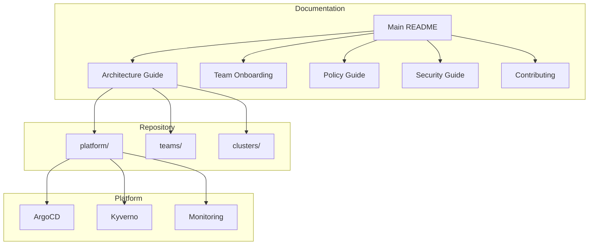

# Documentation

Welcome to the aws-idp-gitops documentation. This directory contains comprehensive guides for using and contributing to the Internal Developer Platform GitOps repository.

## Quick Links

| Document | Description | Audience |
|----------|-------------|----------|
| [Main README](../README.md) | Repository overview and quick start | Everyone |
| [Architecture Guide](ARCHITECTURE.md) | Detailed architecture and design | Platform engineers, architects |
| [Team Onboarding](TEAM-ONBOARDING.md) | Step-by-step team onboarding process | New teams, team leads |
| [Policy Guide](POLICY-GUIDE.md) | Policy enforcement and compliance | Developers, security teams |
| [Security Guide](SECURITY.md) | Security best practices and procedures | Security teams, developers |
| [Contributing Guide](../CONTRIBUTING.md) | Contribution guidelines and workflow | Contributors |

---

## Documentation Structure

### For New Teams

If you're joining the platform:

1. Start with [Team Onboarding Guide](TEAM-ONBOARDING.md)
2. Review [Security Best Practices](SECURITY.md)
3. Understand [Policy Requirements](POLICY-GUIDE.md)
4. Learn the [Architecture](ARCHITECTURE.md)

### For Platform Engineers

If you're managing the platform:

1. Understand the [Architecture](ARCHITECTURE.md)
2. Review [Security Implementation](SECURITY.md)
3. Learn [Policy Management](POLICY-GUIDE.md)
4. Follow [Contributing Guidelines](../CONTRIBUTING.md)

### For Developers

If you're deploying applications:

1. Complete [Team Onboarding](TEAM-ONBOARDING.md)
2. Review [Security Requirements](SECURITY.md#pod-security-standards)
3. Understand [Policy Compliance](POLICY-GUIDE.md)
4. Follow [Contributing Workflow](../CONTRIBUTING.md)

---

## Common Tasks

### Deploying a New Application

1. Add application entry to `teams/<your-team>/team.yaml`
2. Create PR following [Contributing Guidelines](../CONTRIBUTING.md)
3. Ensure application meets [Security Standards](SECURITY.md#pod-security-standards)
4. Wait for ArgoCD to sync

See: [Application Deployment](TEAM-ONBOARDING.md#application-deployment)

### Updating Resource Quotas

1. Modify `resourceQuota` in `teams/<your-team>/team.yaml`
2. Justify increase in PR description
3. Get platform team approval
4. Merge and deploy

See: [Resource Quotas](TEAM-ONBOARDING.md#resource-quota-guidelines)

### Adding Network Access

1. Update `networkPolicy.allowFromNamespaces` in team config
2. Document connectivity requirements
3. Get security review
4. Merge and deploy

See: [Network Security](SECURITY.md#network-security)

### Troubleshooting Deployments

1. Check application status: `argocd app get <app-name>`
2. Review policy violations: `kubectl get policyreport -n <namespace>`
3. View pod logs: `kubectl logs -n <namespace> <pod>`
4. Check [Troubleshooting Guide](../README.md#troubleshooting)

---

## Architecture Overview

---

## Key Concepts

### GitOps

All changes to the cluster are made through Git commits. ArgoCD monitors the repository and automatically applies changes.

**Benefits**:
- Audit trail in Git history
- Rollback capability
- Declarative infrastructure
- Automated deployment

See: [Architecture Guide - GitOps](ARCHITECTURE.md#gitops-architecture)

### Multi-Tenancy

Each team gets an isolated namespace with resource quotas, network policies, and RBAC.

**Isolation Levels**:
- Namespace isolation
- Network isolation
- Resource isolation
- RBAC isolation

See: [Architecture Guide - Multi-Tenancy](ARCHITECTURE.md#multi-tenancy-model)

### Policy Enforcement

Kyverno enforces security and compliance policies at admission time.

**Policy Modes**:
- **Enforce**: Blocks non-compliant resources
- **Audit**: Logs violations
- **Mutate**: Automatically modifies resources

See: [Policy Guide](POLICY-GUIDE.md)

### Security Layers

Defense in depth approach with multiple security layers.

**Layers**:
1. Infrastructure (VPC, Security Groups)
2. Cluster (RBAC, Pod Security)
3. Network (Network Policies)
4. Application (Kyverno Policies)
5. Runtime (Falco, Trivy)

See: [Security Guide](SECURITY.md#defense-in-depth)

---

## Frequently Asked Questions

### How do I onboard my team?

Follow the [Team Onboarding Guide](TEAM-ONBOARDING.md). Create a `team.yaml` file and submit a PR.

### How do I deploy an application?

Add an entry to the `apps` section in your team.yaml. See [Application Deployment](TEAM-ONBOARDING.md#application-deployment).

### Why was my deployment blocked?

Check for policy violations using `kubectl get policyreport -n <namespace>`. See [Policy Guide](POLICY-GUIDE.md).

### How do I manage secrets?

Use External Secrets to sync from AWS Secrets Manager. Never commit secrets to Git. See [Secrets Management](SECURITY.md#secrets-management).

### How do I troubleshoot sync failures?

Use `argocd app get <app-name>` and check the sync status. See [Troubleshooting](../README.md#troubleshooting).

### How do I request more resources?

Update your team.yaml and create a PR with justification. See [Resource Quotas](TEAM-ONBOARDING.md#resource-quota-guidelines).

---

## Additional Resources

### Official Documentation

- [Kubernetes Documentation](https://kubernetes.io/docs/)
- [ArgoCD Documentation](https://argo-cd.readthedocs.io/)
- [Kyverno Documentation](https://kyverno.io/docs/)
- [External Secrets Documentation](https://external-secrets.io/)

### Platform Repositories

- [aws-idp-infra](https://github.com/fast-ish/aws-idp-infra) - Infrastructure as Code
- [aws-eks-infra](https://github.com/fast-ish/aws-eks-infra) - EKS cluster
- [aws-druid-infra](https://github.com/fast-ish/aws-druid-infra) - Apache Druid
- [aws-webapp-infra](https://github.com/fast-ish/aws-webapp-infra) - Web applications

### Training Materials

- Kubernetes Fundamentals
- GitOps Best Practices
- Security in Kubernetes
- Observability and Monitoring

---

## Getting Help

### Support Channels

| Channel | Purpose | Response Time |
|---------|---------|---------------|
| **Slack #platform-support** | Quick questions, troubleshooting | < 1 hour during business hours |
| **Email: platform-team@company.com** | Formal requests, escalations | < 4 hours |
| **Office Hours: Tuesdays 2-3 PM** | In-depth discussions, architecture | Weekly |
| **GitHub Issues** | Bug reports, feature requests | < 1 business day |

### Before Asking for Help

1. Check the relevant documentation
2. Search existing GitHub issues
3. Review the troubleshooting guide
4. Gather relevant error messages and logs

### What to Include in Support Requests

- **Team name and namespace**
- **Application name (if applicable)**
- **Expected behavior vs actual behavior**
- **Error messages and logs**
- **Steps to reproduce**
- **Recent changes (if any)**

---

## Contributing to Documentation

Documentation improvements are always welcome! See the [Contributing Guide](../CONTRIBUTING.md) for details.

### Documentation Standards

- Use clear, concise language
- Include code examples
- Add diagrams where helpful
- Keep examples up to date
- Link to external resources

### Suggesting Improvements

If you find gaps in the documentation:

1. Open a GitHub issue describing the gap
2. Suggest specific improvements
3. Offer to write the content (optional)
4. Submit a PR with changes

---

## Document Change Log

| Date | Document | Change | Author |
|------|----------|--------|--------|
| 2024-12-30 | All | Initial comprehensive documentation | Platform Team |

---

Thank you for using the Internal Developer Platform!
