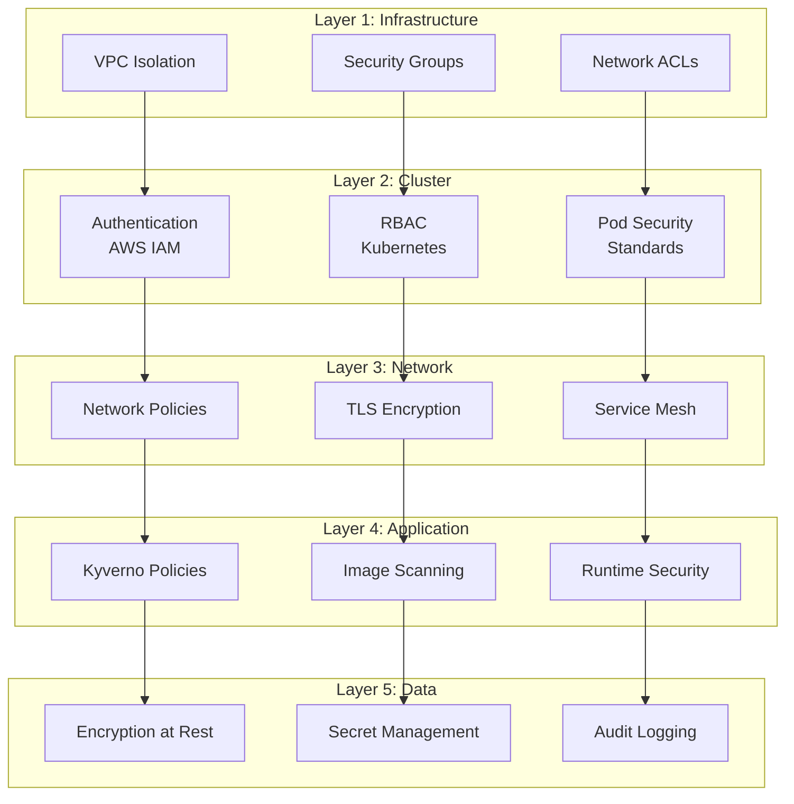
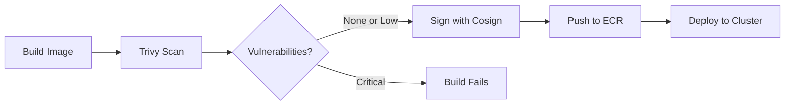
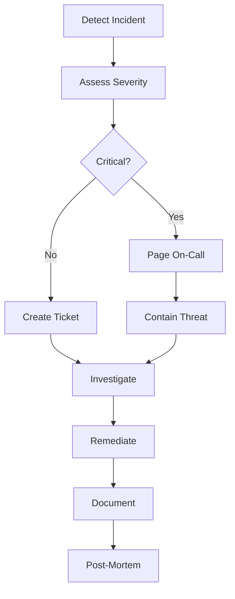

# Security Guide

This document outlines security best practices, policies, and procedures for the Internal Developer Platform GitOps repository.

## Table of Contents

- [Security Overview](#security-overview)
- [Defense in Depth](#defense-in-depth)
- [Pod Security Standards](#pod-security-standards)
- [Network Security](#network-security)
- [Secrets Management](#secrets-management)
- [Container Security](#container-security)
- [Access Control](#access-control)
- [Compliance](#compliance)
- [Incident Response](#incident-response)
- [Security Checklist](#security-checklist)

---

## Security Overview

The platform implements a multi-layered security approach following the principle of defense in depth. Security is enforced at every level from the infrastructure to the application.

### Security Layers



### Shared Responsibility Model

| Layer | Platform Responsibility | Team Responsibility |
|-------|------------------------|---------------------|
| **Infrastructure** | VPC, subnets, security groups | - |
| **Cluster** | EKS control plane, node security | - |
| **Platform Components** | ArgoCD, Kyverno, monitoring | - |
| **Network Policies** | Default deny all | Define required access |
| **Pod Security** | Enforce PSS Restricted | Comply with policies |
| **Container Images** | Base image scanning | Application image security |
| **Secrets** | External Secrets Operator | Secret rotation, access |
| **Application** | - | Secure coding, dependencies |

---

## Defense in Depth

### 1. Infrastructure Security

**VPC Configuration**:
- Private subnets for worker nodes
- Public subnets only for load balancers
- NACLs for subnet-level filtering
- VPC Flow Logs for network monitoring

**EKS Security**:
- Encrypted EBS volumes
- Encrypted secrets (envelope encryption)
- Private endpoint access
- Audit logging enabled

### 2. Identity and Access Management

**AWS IAM**:
- Least privilege service roles
- IAM Roles for Service Accounts (IRSA)
- MFA for human users
- Regular access reviews

**Kubernetes RBAC**:
- Namespace-scoped roles
- Explicit deny by default
- Service account isolation
- No direct cluster-admin access

### 3. Runtime Protection

**Falco Runtime Security**:
```yaml
# Example Falco rule
- rule: Unauthorized Process
  desc: Detect unauthorized process execution
  condition: >
    spawned_process and
    container and
    not proc.name in (allowed_processes)
  output: >
    Unauthorized process started
    (user=%user.name process=%proc.name
    container=%container.name image=%container.image)
  priority: WARNING
  tags: [process, container]
```

---

## Pod Security Standards

The platform enforces [Pod Security Standards](https://kubernetes.io/docs/concepts/security/pod-security-standards/) at the **Restricted** level.

### Restricted Profile Requirements

All pods must comply with these requirements:

| Requirement | Description | Why It Matters |
|-------------|-------------|----------------|
| **Non-root user** | `runAsNonRoot: true` | Limits impact of container breakout |
| **No privilege escalation** | `allowPrivilegeEscalation: false` | Prevents gaining root access |
| **Drop capabilities** | `drop: [ALL]` | Removes unnecessary Linux capabilities |
| **Read-only root filesystem** | `readOnlyRootFilesystem: true` | Prevents malware persistence |
| **Seccomp profile** | `type: RuntimeDefault` | Limits syscalls available to container |
| **No host namespaces** | No `hostPID`, `hostIPC`, `hostNetwork` | Isolates from host processes |

### Compliant Pod Example

```yaml
apiVersion: v1
kind: Pod
metadata:
  name: secure-app
spec:
  securityContext:
    runAsNonRoot: true
    runAsUser: 1000
    fsGroup: 1000
    seccompProfile:
      type: RuntimeDefault
  containers:
    - name: app
      image: my-app:1.0.0
      securityContext:
        allowPrivilegeEscalation: false
        readOnlyRootFilesystem: true
        capabilities:
          drop:
            - ALL
      resources:
        requests:
          cpu: 100m
          memory: 128Mi
        limits:
          cpu: 500m
          memory: 512Mi
      volumeMounts:
        - name: tmp
          mountPath: /tmp
        - name: cache
          mountPath: /app/cache
  volumes:
    - name: tmp
      emptyDir: {}
    - name: cache
      emptyDir: {}
```

### Common Violations and Fixes

| Violation | Fix |
|-----------|-----|
| Running as root | Set `runAsUser: 1000` and rebuild image |
| Writable root filesystem | Use `emptyDir` volumes for temp files |
| Privileged container | Remove `privileged: true` and use least privilege |
| Host path mounts | Use PVCs or emptyDir instead |
| Dangerous capabilities | Drop all caps, add only NET_BIND_SERVICE if needed |

---

## Network Security

### Default Deny Policy

Every namespace has a default deny-all policy:

```yaml
apiVersion: networking.k8s.io/v1
kind: NetworkPolicy
metadata:
  name: default-deny-all
  namespace: team-backend
spec:
  podSelector: {}
  policyTypes:
    - Ingress
    - Egress
```

### Allow DNS

All namespaces can query DNS:

```yaml
apiVersion: networking.k8s.io/v1
kind: NetworkPolicy
metadata:
  name: allow-dns
spec:
  podSelector: {}
  policyTypes:
    - Egress
  egress:
    - to:
        - namespaceSelector:
            matchLabels:
              name: kube-system
        - podSelector:
            matchLabels:
              k8s-app: kube-dns
      ports:
        - protocol: UDP
          port: 53
```

### Allow Specific Traffic

Example: Allow frontend to call backend API:

```yaml
apiVersion: networking.k8s.io/v1
kind: NetworkPolicy
metadata:
  name: allow-from-frontend
  namespace: team-backend
spec:
  podSelector:
    matchLabels:
      app: api
  policyTypes:
    - Ingress
  ingress:
    - from:
        - namespaceSelector:
            matchLabels:
              team: frontend
        - podSelector:
            matchLabels:
              app: web
      ports:
        - protocol: TCP
          port: 8080
```

### TLS Enforcement

**In-Cluster Communication**:
- Use cert-manager for automatic certificate issuance
- Rotate certificates every 90 days
- mTLS for service-to-service communication (optional with service mesh)

**External Communication**:
- TLS 1.2+ only
- Strong cipher suites
- Certificate pinning for critical services

---

## Secrets Management

### Never Commit Secrets to Git

**Prohibited**:
```yaml
# ❌ NEVER DO THIS
apiVersion: v1
kind: Secret
metadata:
  name: db-password
data:
  password: cGFzc3dvcmQxMjM=  # base64 is NOT encryption!
```

### Use External Secrets

**Correct approach**:

1. Store secret in AWS Secrets Manager:
```bash
aws secretsmanager create-secret \
  --name /team-backend/database/password \
  --secret-string "actual-secure-password"
```

2. Create ExternalSecret:
```yaml
apiVersion: external-secrets.io/v1beta1
kind: ExternalSecret
metadata:
  name: db-credentials
  namespace: team-backend
spec:
  refreshInterval: 1h
  secretStoreRef:
    name: aws-secrets-manager
    kind: SecretStore
  target:
    name: db-credentials
    creationPolicy: Owner
  data:
    - secretKey: password
      remoteRef:
        key: /team-backend/database/password
```

3. Use the secret:
```yaml
apiVersion: apps/v1
kind: Deployment
spec:
  template:
    spec:
      containers:
        - name: app
          env:
            - name: DB_PASSWORD
              valueFrom:
                secretKeyRef:
                  name: db-credentials
                  key: password
```

### Secret Rotation

| Secret Type | Rotation Frequency | Method |
|-------------|-------------------|--------|
| Database passwords | 90 days | AWS Secrets Manager rotation |
| API keys | 180 days | Manual rotation |
| TLS certificates | 90 days | cert-manager automatic |
| Service account tokens | 24 hours | Kubernetes automatic |

---

## Container Security

### Image Security

**Base Image Requirements**:
- Use minimal base images (distroless, alpine)
- Scan images for vulnerabilities
- Sign images with Cosign
- Use specific tags, never `latest`

**Scanning Pipeline**:



### Trivy Scanning

Trivy Operator automatically scans running images:

```bash
# View vulnerability reports
kubectl get vulnerabilityreports -A

# Get detailed report for a workload
kubectl get vulnerabilityreport -n team-backend \
  deployment-backend-api-backend-api -o yaml
```

### Image Signing

Sign images with Cosign:

```bash
# Generate key pair
cosign generate-key-pair

# Sign image
cosign sign --key cosign.key \
  <account>.dkr.ecr.<region>.amazonaws.com/my-app:v1.0.0

# Verify signature
cosign verify --key cosign.pub \
  <account>.dkr.ecr.<region>.amazonaws.com/my-app:v1.0.0
```

### Allowed Registries

Only images from approved registries are allowed:

| Registry | Purpose | Access |
|----------|---------|--------|
| `<account>.dkr.ecr.<region>.amazonaws.com` | Organization images | Team namespaces |
| `public.ecr.aws` | Public AWS images | Platform only |
| `docker.io/library` | Official Docker images | Restricted |
| `ghcr.io/fast-ish` | Organization GitHub images | Team namespaces |

---

## Access Control

### Kubernetes RBAC

**Team Developer Role**:
```yaml
apiVersion: rbac.authorization.k8s.io/v1
kind: Role
metadata:
  name: developer
  namespace: team-backend
rules:
  - apiGroups: ["", "apps", "batch"]
    resources: ["*"]
    verbs: ["get", "list", "watch", "create", "update", "patch", "delete"]
  - apiGroups: [""]
    resources: ["resourcequotas", "limitranges"]
    verbs: ["get", "list", "watch"]
  - apiGroups: ["networking.k8s.io"]
    resources: ["networkpolicies"]
    verbs: ["get", "list", "watch"]
```

**Team Viewer Role**:
```yaml
apiVersion: rbac.authorization.k8s.io/v1
kind: Role
metadata:
  name: viewer
  namespace: team-backend
rules:
  - apiGroups: ["*"]
    resources: ["*"]
    verbs: ["get", "list", "watch"]
```

### Service Account Security

**Don't auto-mount tokens**:
```yaml
apiVersion: v1
kind: ServiceAccount
metadata:
  name: app
automountServiceAccountToken: false
```

**Use IRSA for AWS access**:
```yaml
apiVersion: v1
kind: ServiceAccount
metadata:
  name: app
  annotations:
    eks.amazonaws.com/role-arn: arn:aws:iam::ACCOUNT:role/app-role
automountServiceAccountToken: true
```

---

## Compliance

### Audit Logging

All cluster access is logged:

```bash
# View audit logs in CloudWatch
aws logs tail /aws/eks/<cluster-name>/cluster --follow

# Filter for specific user
aws logs filter-pattern '{ $.user.username = "admin@company.com" }' \
  /aws/eks/<cluster-name>/cluster
```

### Policy Compliance

Check compliance with:

```bash
# Get all policy reports
kubectl get policyreport -A

# Compliance summary
kubectl get policyreport -A -o json | \
  jq -r '.items[] | "\(.metadata.namespace): \(.summary)"'
```

### SOC 2 / ISO 27001 Controls

| Control | Implementation |
|---------|----------------|
| Access Control | RBAC, MFA, regular access reviews |
| Encryption | TLS in transit, encryption at rest |
| Audit Logging | CloudWatch logs, 1 year retention |
| Vulnerability Management | Trivy scanning, automated patching |
| Incident Response | Falco alerts, runbooks |
| Change Management | GitOps, PR reviews, approval workflows |

---

## Incident Response

### Security Incident Workflow



### Severity Levels

| Level | Description | Response Time | Example |
|-------|-------------|---------------|---------|
| **P0 - Critical** | Active security breach | Immediate | Unauthorized cluster access |
| **P1 - High** | Potential security breach | 1 hour | Critical CVE in running image |
| **P2 - Medium** | Security policy violation | 4 hours | Misconfigured network policy |
| **P3 - Low** | Security best practice gap | 1 day | Missing resource limits |

### Common Incident Types

**1. Unauthorized Access**
```bash
# Check recent authentication
kubectl get events -A | grep Authentication

# Review RBAC bindings
kubectl get rolebindings -A -o wide

# Audit service account usage
kubectl get sa -A
```

**2. Malicious Container**
```bash
# Get Falco alerts
kubectl logs -n falco -l app=falco

# Check for suspicious processes
kubectl exec -it <pod> -- ps aux

# Review container image
trivy image <image-name>
```

**3. Data Exfiltration**
```bash
# Check network policies
kubectl get networkpolicies -A

# Review egress traffic
kubectl logs -n <namespace> <pod> | grep -i "connection"

# Check VPC Flow Logs
aws ec2 describe-flow-logs
```

---

## Security Checklist

### Application Deployment

- [ ] Container runs as non-root user
- [ ] Read-only root filesystem
- [ ] All capabilities dropped
- [ ] Resource limits defined
- [ ] Health probes configured
- [ ] Secrets via External Secrets
- [ ] Network policies defined
- [ ] Image scanned for vulnerabilities
- [ ] Image signed with Cosign
- [ ] TLS enabled for external traffic

### Team Onboarding

- [ ] Resource quotas appropriate
- [ ] Network policies reviewed
- [ ] RBAC roles assigned
- [ ] AWS IAM roles configured (IRSA)
- [ ] Team has security training
- [ ] Incident contacts documented

### Regular Maintenance

- [ ] Review access permissions (monthly)
- [ ] Rotate secrets (per schedule)
- [ ] Update base images (weekly)
- [ ] Patch vulnerabilities (within SLA)
- [ ] Review audit logs (weekly)
- [ ] Test backup restores (monthly)
- [ ] Update network policies (as needed)
- [ ] Review policy violations (daily)

---

## Related Documentation

- [README](../README.md) - Main documentation
- [Architecture Guide](ARCHITECTURE.md) - Platform architecture
- [Policy Guide](POLICY-GUIDE.md) - Detailed policy information
- [Team Onboarding](TEAM-ONBOARDING.md) - Team onboarding process

## External References

- [Kubernetes Security Best Practices](https://kubernetes.io/docs/concepts/security/)
- [Pod Security Standards](https://kubernetes.io/docs/concepts/security/pod-security-standards/)
- [CIS Kubernetes Benchmark](https://www.cisecurity.org/benchmark/kubernetes)
- [OWASP Kubernetes Security Cheat Sheet](https://cheatsheetseries.owasp.org/cheatsheets/Kubernetes_Security_Cheat_Sheet.html)
- [NSA/CISA Kubernetes Hardening Guide](https://www.nsa.gov/Press-Room/News-Highlights/Article/Article/2716980/)
